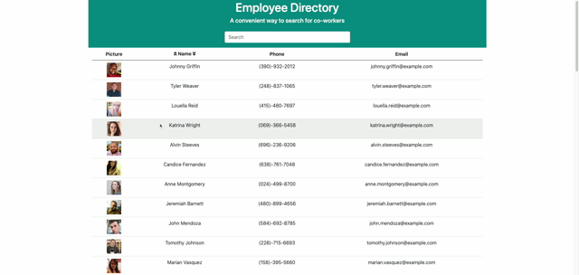

# Employee-Directory
  
  
  ## **Table of Contents**
  * [Live Link](#live-link)
  * [Description](#description)
  * [Demo](#demo)
  * [Contributors](#contributors)
  * [Technology](#technology-stack)
  * [Questions](#questions)
  * [License](#license)
      
  ## **Live-Link**
https://reanderson89.github.io/employee-directory/

  ## **Description**
  This app offers users an easy place to go for some basic information of their co-workers. The user can scroll through the employees listed, they can also sort the employees by their respective names using the arrows next to the "Name" heading. The user also has the capability of searching for the employee they are looking for by either their Name, Phone, and/or email. The search by is made in such a way that the user does not need to select the category they wish to search in, all they need to do is type in the information they are after.

  ## **Demo**
  

      
   ## **Contributors**
   [Robert Anderson](https://github.com/reanderson89)

  ## **Technology-Stack**
  javascript, node.js, react, css, axios, bootstrap

  ## **Questions**   
  ####    **For any questions or inquiries please contact**
    **Robert Anderson**
  * #### **GitHub:** [@reanderson89](https://github.com/reanderson89)
  * #### **Email:** reanderson89@gmail.com

   
  ## **License**
  MIT
      

